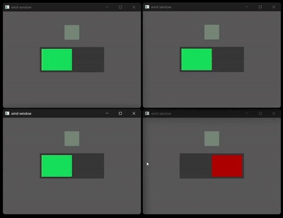
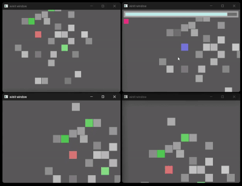

# 🎮 Rust Multiplayer Minigame

A mini multiplayer game written entirely in Rust — featuring an async Tokio TCP server, WGPU-based GUI client, and a CLI client alternative. Designed to be real-time, modular, and highly testable.

Features:
- ✔️ Lobby system
- ✔️ Hider/Seeker role logic
- ✔️ Custom JSON protocol
- ✔️ Procedurally generated map
- ✔️ Full async & multithreaded code
- ✔️ Unit & integration tested
- ✔️ Ingame Chat (CLI only so far)

## Lobby

Connecting players are placed in lobby. If all of them hit ready then game starts:

  

## Gameplay

One player is selected as seeker. Seeker can left-click entities to try uncovering them. If he miss then loose 1 heart. If seeker loose all hearts or remaining time hits zero then he loose. If seeker corectly marks hider then hider gets uncovered.

  

## Architecture

Server:
- Async TCP server built with [Tokio]
- 2 main tasks loops:
  - networking handling incomming connections, handling requests, forming responses
  - game world managing game states, updating entities
- clients connections not wired immediatelly to ingame Entity (ECS based)

Client:
- abstractian over TCP request-responses
- multithreading friendly
- WGPU frontend

## Tests & Running

Tests:
- Unit tests coves complex logic
- Integration tests covers cleint-server requersts and state transition

Run:
- server mode `rust_multiplayer.exe server`, server will be exposed on default address,
- client mode `rust_multiplayer.exe player`, client will be conencted to server, server assigns random player name
- cli mode `rust_multiplayer.exe client`, in development, executing requests

## Crates / Tools Used
[Tokio] – async runtime
[Serde] – serialization
[WGPU] – GPU rendering
[Clap] – command-line parsing
[thiserror] – error handling

